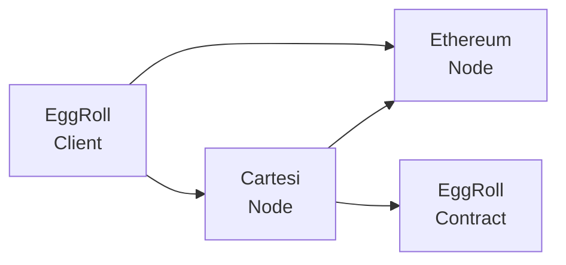

EggRoll Documentation
=

EggRoll divides a Cartesi DApp into two parts: contract and client.
The contract runs in the blockchain inside a Cartesi VM and relies on the Cartesi Rollups API.
The client runs off-chain and communicates with the contract using the Cartesi Reader Node APIs and the Ethereum API.
EggRoll provides abstractions for both sides of the DApp.



# Quick Look

The code below shows a simple contract that echoes the received input.

## Contract

The first step to using EggRoll is defining the contract struct, which executes inside the Cartesi Machine.

<!---
cat ./examples/template/contract/main.go
-->
```go
type TemplateContract struct {
	eggroll.DefaultContract
}

func (c *TemplateContract) Advance(env eggroll.Env) (any, error) {
	input := env.RawInput()
	env.Logf("received: %v", string(input))
	return input, nil
}

func main() {
	eggroll.Roll(&TemplateContract{})
}
```

## Client

Off-chain, you can use the `eggroll.Client` struct to interact with the contract.

<!---
cat ./examples/template/client/main.go
-->
```go
func main() {
	input := os.Args[1]
	ctx := context.Background()
	client, signer, _ := eggroll.NewDevClient(ctx, nil)
	inputIndex, _ := client.SendInput(ctx, signer, []byte(input))
	result, _ := client.WaitFor(ctx, inputIndex)
	fmt.Println(string(result.RawReturn()))
}
```

To see this example more in-depth, go to [Getting Started](/template).
